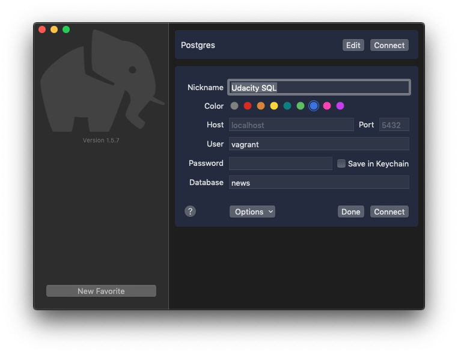
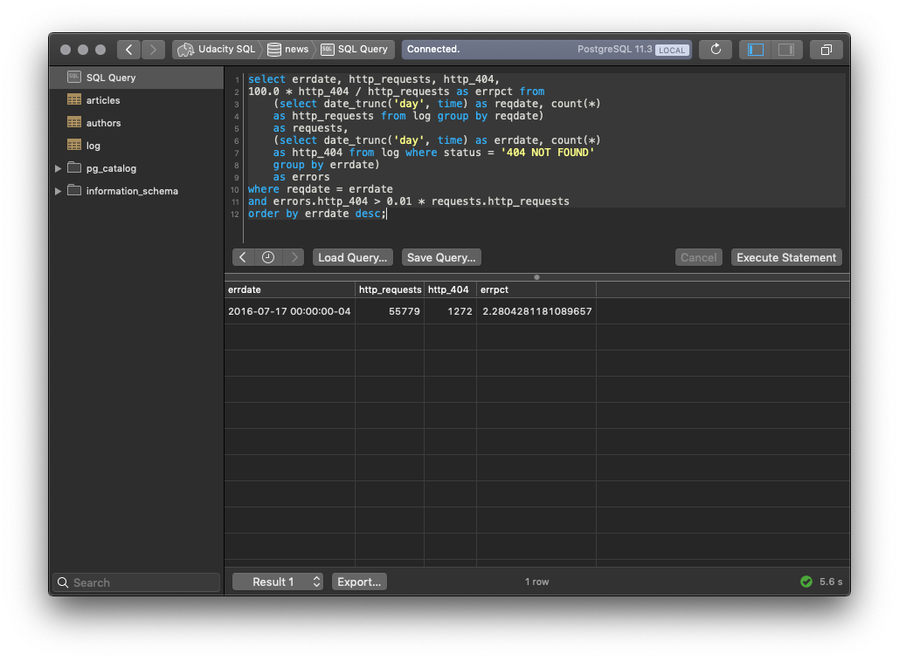

# SQL database logs analysis

<a href="https://www.udacity.com/">
  
</a>

[Udacity Full Stack Developer Nanodegree program](https://www.udacity.com/course/full-stack-web-developer-nanodegree--nd004)

Brendon Smith ([br3ndonland](https://github.com/br3ndonland))

[](https://choosealicense.com/licenses/mit/)

## Table of Contents <!-- omit in toc -->

- [Project description](#project-description)
- [Repository contents](#repository-contents)
  - [Required files](#required-files)
  - [Other files](#other-files)
- [Installation](#installation)
  - [Run with Pipenv virtual environment](#run-with-pipenv-virtual-environment)
  - [Run with Docker Compose](#run-with-docker-compose)
  - [Run with Vagrant virtual machine](#run-with-vagrant-virtual-machine)
- [A tale of three queries](#a-tale-of-three-queries)
  - [1. Most popular articles](#1-most-popular-articles)
  - [2. Most popular authors](#2-most-popular-authors)
  - [3. HTTP request error rate](#3-http-request-error-rate)

## Project description

Databases can contain trillions of rows and columns, something that spreadsheet programs like Google Sheets and Microsoft Excel simply can't handle. Structured Query Language (SQL) is used to query (ask) the computer to retrieve information from databases.

I completed this project as part of the Udacity Full Stack Developer Nanodegree program. Students were asked to write SQL queries to extract information from a database of news articles with over a million rows. The SQL queries contain advanced joins, selection, and calculation features. Another general-purpose computing language called Python was used to group and control the queries.

[(Back to TOC)](#table-of-contents)

## Repository contents

### Required files

- _[logs.py](logs.py)_ - main program code
- _[logs-output.txt](logs-output.txt)_ - example code output
- _[README.md](README.md)_ - this file, a concise description of the project

### Other files

- _[logs-methods.md](info/logs-methods.md)_ - computational narrative explaining how I wrote the code for the project
- _[logs-review.md](info/logs-review.md)_ - Udacity code review
- _[logs-udacity.md](info/logs-udacity.md)_ - project description, installation instructions, and rubric from Udacity

[(Back to TOC)](#table-of-contents)

## Installation

The application can be run by setting up either a virtual environment or a virtual machine. Instructions for each option are provided below.

### Run with Pipenv virtual environment

#### Clone repository

```sh
~
❯ cd /path/to/repo
~/path/to/repo
❯ git clone git@github.com:br3ndonland/udacity-fsnd-sql-logs.git
```

#### Install dependencies

Install dependencies with a package manager of choice, such as [Homebrew](https://brew.sh/) on macOS.

```sh
brew install python pipenv
brew cask install postgres postico
```

Major dependencies:

- [Python](https://www.python.org/)
- [Pipenv](https://pipenv.readthedocs.io/)
- [Postgres](https://postgresapp.com/)
- [Postico](https://eggerapps.at/postico/) (optional): helpful GUI that can complement Postgres. Postico needs Postgres to connect to local databases.

#### Install Pipenv virtual environment

- **[Pipenv](https://pipenv.readthedocs.io/en/latest/)** was used to manage the development virtual environment for this project.

  - Install Pipenv with a system package manager like [Homebrew](https://brew.sh/), or with the Python package manager `pip`.
  - Use Pipenv to install the virtual environment from the _Pipfile_ with `pipenv install --dev`.

    - The `--dev` flag was used to accommodate the Black autoformatter, which is considered a pre-release package (see [code style](#python-code-style) below).
    - When generating the initial _Pipfile_ containing the Black dev package, the `--pre` flag added a line to the _Pipfile_ to allow pre-release packages. (TOML format):

      ```toml
      [pipenv]
      allow_prereleases = true
      ```

    - Further information can be found in the [Pipenv docs](https://pipenv.readthedocs.io/en/latest/basics/#specifying-versions-of-a-package).

- VSCode can be configured to recognize the Pipenv virtual environment. See [Using Python environments in VS Code](https://code.visualstudio.com/docs/python/environments).
  - _Command Palette -> Python: Select Interpreter_. Select virtual environment.
  - _Command Palette -> Python: Create Terminal_. Creates a terminal and automatically activates the virtual environment. If the virtual environment is set as the interpreter for the workspace, new terminal windows will automatically start in the virtual environment.

#### Set up database

[Postgres](https://postgresapp.com/) should be installed as described above. [Postico](https://eggerapps.at/postico/) is a helpful GUI for PostgreSQL that can complement (but not replace) Postgres. Postico needs Postgres to connect to local databases.

##### Unzip news data

- Unzip _data/newsdata.zip_. If the file is not present, [download](https://d17h27t6h515a5.cloudfront.net/topher/2016/August/57b5f748_newsdata/newsdata.zip) and save in the _data/_ directory.
- The zipped news database has been added to this repository with [Git LFS](https://git-lfs.github.com/). To work with Git LFS:

  ```sh
  # Install Git LFS on your system. For macOS:
  ~
  ❯ brew install git-lfs
  ~
  ❯ cd ~/path/to/repo
  # Create .gitattributes and tell Git LFS what to track:
  ~/path/to/repo
  ❯ touch .gitattributes
  ~/path/to/repo
  ❯ git lfs track "*.zip"
  Tracking "*.zip"
  # Commit .gitattributes
  ~/path/to/repo
  ❯ git add .gitattributes
  ~/path/to/repo
  ❯ git commit -m "Initialize Git LFS"
  # Initialize Git LFS, once per repo:
  ~/path/to/repo
  ❯ git lfs install
  Updated git hooks.
  Git LFS initialized.
  ~/path/to/repo
  ❯ git add --all
  ~/path/to/repo
  ❯ git commit
  ~/path/to/repo
  ❯ git lfs ls-files
  SHA * data/newsdata.zip
  ~/path/to/repo
  ❯ git push
  # Should see something like "Uploading LFS objects"
  ```

- It is important to verify that Git LFS is properly initialized before committing files to be tracked with LFS. It is very difficult to get files un-tracked by Git after they have been committed. If you get into this situation, you can try `git lfs migrate import`, as described in [this GitHub issue](https://github.com/git-lfs/git-lfs/issues/1939#issuecomment-353247795), but it might be easier to just locally [undo](https://github.blog/2015-06-08-how-to-undo-almost-anything-with-git/) and create a new branch.

##### Create user and database

- Enter PostgreSQL with `psql` on the command line.
- Create `vagrant` user: _newsdata.sql_ is configured for a PostgreSQL user `vagrant`. When using the Vagrant virtual machine, this step is specified in the _Vagrantfile_ and performed during `vagrant up`.
- Create `news` database.
- Grant user access to database.
- Load _newsdata.sql_ into database.

```
~
❯ psql
psql (11.3)
Type "help" for help.

user=# CREATE USER vagrant;
user=# CREATE DATABASE news;
user=# GRANT ALL PRIVILEGES ON DATABASE "news" to vagrant;
user=# \q

~
❯ cd /path/to/repo
~/path/to/repo
❯ psql -d news -f data/newsdata.sql
```

#### Run queries

The queries can be run by `psql`, Postico, or Python.

##### Run queries with `psql`

```sh
~/path/to/repo
❯ psql -U vagrant -d news -a -f ./sql/1-most-popular-articles.sql
❯ psql -U vagrant -d news -a -f ./sql/2-most-popular-authors.sql
❯ psql -U vagrant -d news -a -f ./sql/3-http-request-error-rate.sql
```

##### Run queries with Postico

###### Set up database connection



###### Connect to database


###### Run queries



##### Run queries with Python

```sh
~/path/to/repo
❯ pipenv shell
udacity-fsnd-sql-logs-hash ❯ python logs.py
```

### Run with Docker Compose

#### Docker background

- **[Docker](https://www.docker.com/)** is a technology for running lightweight virtual machines called **containers**.
  - An **image** is the executable set of files read by Docker.
  - A **container** is a running image.
  - The **[Dockerfile](https://docs.docker.com/engine/reference/builder/)** tells Docker how to build the container.
- VSCode has built-in Docker features. See [Working with Docker in VSCode](https://code.visualstudio.com/docs/azure/docker) and the [VSCode tutorial on deploying Python with Docker](https://code.visualstudio.com/docs/python/tutorial-deploy-containers).
- To install Docker tools locally:
  - Ubuntu Linux: follow the [instructions for Ubuntu Linux](https://docs.docker.com/install/linux/docker-ce/ubuntu/), making sure to follow the [postinstallation steps](https://docs.docker.com/install/linux/linux-postinstall/) to activate the Docker daemon.
  - macOS and Windows: install [Docker Desktop](https://www.docker.com/products/docker-desktop) (available via [Homebrew](https://brew.sh) with `brew cask install docker`).
- To build this Docker image and run the container:

  ```sh
  cd path/to/repo
  docker build . -t app:latest
  docker run -d -p 80:80 app:latest
  ```

  - `-t` web tells Docker to name the image `app`. Adding `.` builds from the current directory.
  - `-d` runs the container in detached mode. Docker will display the container hash and return the terminal prompt.
  - `-p 80:80` maps the http port 80 from your local machine to port 1040 in the container.
  - A tag can be specified with `name:tag`, otherwise, the tag `latest` will be used.

- <details><summary>Expand this details element for more <a href="https://docs.docker.com/engine/reference/commandline/cli/">useful Docker commands</a>.</summary>

  ```sh
  # List images
  docker image ls

  # List containers
  docker container ls

  # Inspect a container (web in this example) and return the IP Address
  docker inspect web | grep IPAddress

  # Stop a container
  docker container stop # container hash

  # Remove a downloaded image
  docker image rm # image hash or name

  # Remove a container
  docker container rm # container hash

  # Prune stopped containers (wipes them and resets their state)
  docker container prune

  # Connect to running container (sort of like SSH)
  docker ps # get ID/hash of container you want to connect to
  docker exec -it [ID] /bin/bash
  # Or, connect as root:
  docker exec -u 0 -it [ID] /bin/bash

  # Copy file to/from container:
  docker cp [container_name]:/path/to/file destination.file
  ```

  </summary>

#### Pipenv and Docker

- There are a few [adjustments](https://stackoverflow.com/a/49705601) needed to enable Pipenv and Docker to work together.
- Pipenv must first be installed with `pip`.
- Python dependencies are then installed from _Pipfile.lock_.

  - Docker containers don't need virtual environments, so the `--system` flag is used to install packages into the container's global Python installation. Thus, it is not necessary to enter the virtual environment with `pipenv shell` before starting the application.
  - The `--deploy` flag causes the build to fail if the _Pipfile.lock_ is out of date.
  - The `--ignore-pipfile` flag tells Pipenv to use the _Pipfile.lock_ for installation instead of the _Pipfile_.

  ```dockerfile
  # Pull an image: alpine images are tightly controlled and small in size
  FROM python:3.7-alpine
  LABEL app=news
  WORKDIR /app
  # Copy the directory to /app in the container
  COPY . /app
  # Install psycopg2 PostgreSQL dependencies
  RUN apk update; apk add build-base postgresql postgresql-dev libpq
  # Install Pipenv
  RUN python -m pip install pipenv
  # Install packages from Pipfile.lock, configured for Docker deployments
  RUN pipenv install --system --deploy --ignore-pipfile
  ```

#### Docker Compose

_Coming soon!_ A preliminary Docker Compose file has been added, but the application is not fully functional within Docker yet.

### Run with Vagrant virtual machine

A virtual machine can be used to run the code from an operating system with a defined configuration. The virtual machine has all the dependencies needed to run the application.

#### Install virtual machine

##### Install dependencies

- HashiCorp [Vagrant](https://www.vagrantup.com/) 2.0.4 with Ubuntu 16.04.4 LTS (GNU/Linux 4.4.0-75-generic x86_64)
  - Software that provides an operating system in a defined configuration, allowing it to run identically across many personal computers.
  - Would be possible if we added a
- Vagrant and VirtualBox can be installed with Homebrew Cask:

  ```sh
  brew cask install vagrant virtualbox
  ```

##### Install Vagrant configuration

- Vagrant creates a virtual environment using a [provider](https://www.vagrantup.com/docs/providers/).
  - Oracle VirtualBox is the most common provider used.
  - [Docker can be used as a Vagrant provider](https://www.vagrantup.com/docs/docker/) instead of VirtualBox.
- The provider normally installs the operating system using [boxes](https://www.vagrantup.com/docs/boxes.html). The Docker provider does not require a `config.vm.box` setting. Rather, it pulls an image from a container registry like Docker Hub. In this case, the [centos/python-36-centos7](https://hub.docker.com/r/centos/python-36-centos7) image is used.
- Vagrant is configured with a _Vagrantfile_.
  - This project was originally completed with the [Udacity virtual machine configuration](https://github.com/udacity/fullstack-nanodegree-vm), a Git repository from Udacity that contains a _Vagrantfile_ to configure Vagrant. If using the Udacity configuration, note that some of the necessary Python modules in the Udacity virtual machine configuration are only included for Python 2, and not Python 3. If needed, install the modules with `pip`.
  - A _Vagrantfile_ was later added directly to this repo, with a CentOS and Docker setup.
- Vagrant reads the _Vagrantfile_, and uses the provider to run the virtual environment.
- Install the Udacity Vagrant virtual machine using the instructions in [logs-udacity.md](info/logs-udacity.md). Summary:

  ```sh
  ~
  ❯ cd /path/to/repo
  ~/path/to/repo
  ❯ git clone git@github.com:udacity/fullstack-nanodegree-vm.git
  ~/path/to/repo
  ❯ cd fullstack-nanodegree-vm/vagrant
  ~/path/to/repo/fullstack-nanodegree-vm/vagrant
  ❯ git clone git@github.com:br3ndonland/udacity-fsnd-sql-logs.git
  ~/path/to/repo/fullstack-nanodegree-vm/vagrant
  ❯ vagrant up
  ~/path/to/repo/fullstack-nanodegree-vm/vagrant
  ❯ vagrant ssh
  ❯ vagrant@vagrant:~$ cd /vagrant/udacity-fsnd-sql-logs
  vagrant@vagrant:/vagrant/logs$ python3 logs.py
  ```

[(Back to TOC)](#table-of-contents)

## A tale of three queries

I implemented three SQL queries:

### 1. Most popular articles

_What are the most popular three articles of all time?_

Returns a sorted list of the three most highly accessed articles, with the top article first.

[Query](sql/1-most-popular-articles.sql):

```sql
select title, num from
    (select substr(path, 10), count(*) as num from log
    where path !='/' group by path)
as hits, articles where substr = slug order by num desc limit 3;
```

Terminal output:

```text
              title               | views
----------------------------------+--------
 Candidate is jerk, alleges rival | 338647
 Bears love berries, alleges bear | 253801
 Bad things gone, say good people | 170098
(3 rows)
```

### 2. Most popular authors

_Who are the most popular article authors of all time?_

Returns a sorted list of the most popular article authors, with the most popular author at the top.

[Query](sql/2-most-popular-authors.sql):

```sql
select name, sum(views) as total_views from
    (select name, author, title, views from
        (select substr(path, 10), count(*) as views from log
            where path !='/' group by path)
        as hits, articles, authors
        where substr = slug and author = authors.id
        order by views desc)
    as threetables group by name order by total_views desc;
```

Terminal output:

```text
          name          | total_views
------------------------+-------------
 Ursula La Multa        |      507594
 Rudolf von Treppenwitz |      423457
 Anonymous Contributor  |      170098
 Markoff Chaney         |       84557
(4 rows)
```

### 3. HTTP request error rate

_On which days did more than 1% of requests lead to errors?_

Returns a list of days on which >1% of HTTP requests resulted in HTTP error codes.

[Query](sql/3-http-request-error-rate.sql):

```sql
select errdate, http_requests, http_404,
100.0 * http_404 / http_requests as errpct from
    (select date_trunc('day', time) as reqdate, count(*)
    as http_requests from log group by reqdate)
    as requests,
    (select date_trunc('day', time) as errdate, count(*)
    as http_404 from log where status = '404 NOT FOUND'
    group by errdate)
    as errors
where reqdate = errdate
and errors.http_404 > 0.01 * requests.http_requests
order by errdate desc;
```

Terminal output:

```text
        errdate         | http_requests | http_404 |       errpct
------------------------+---------------+----------+--------------------
 2016-07-17 00:00:00+00 |         55907 |     1265 | 2.2626862468027260
(1 row)
```

[(Back to TOC)](#table-of-contents)
